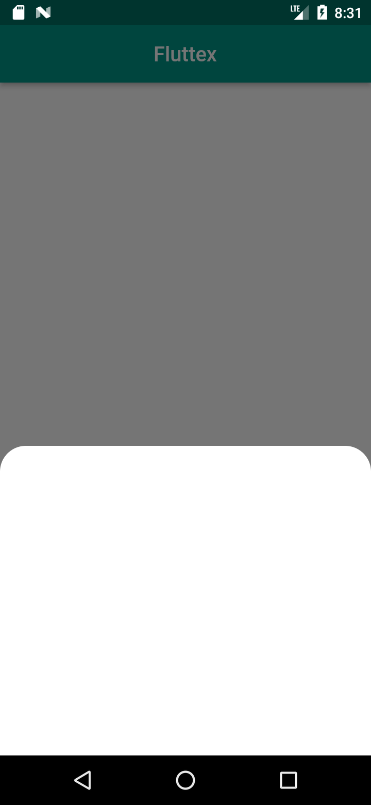
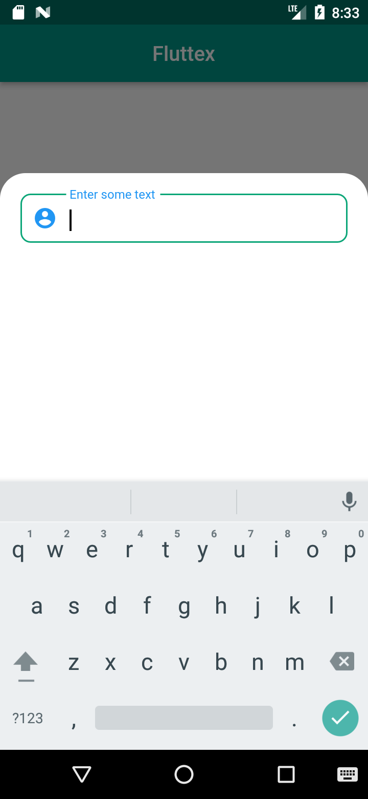
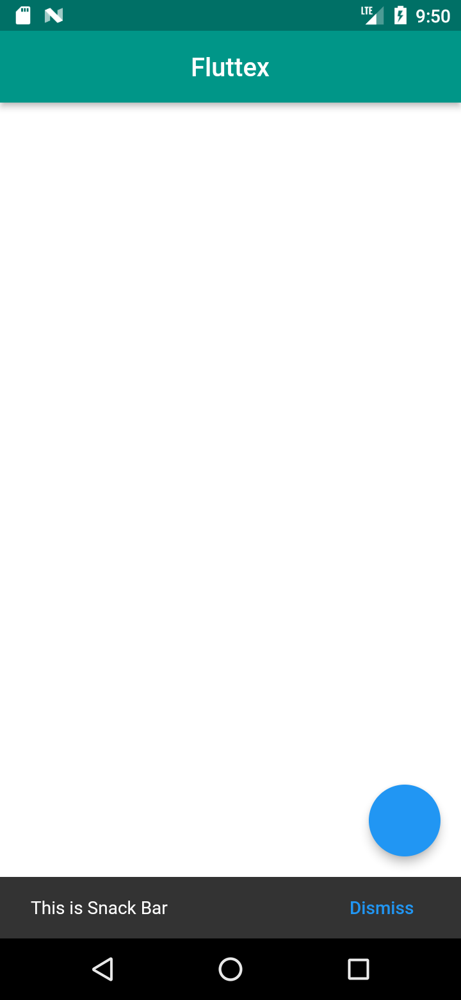

# Easy and Fast coding using Fluttex

##### Fluttex is a package that developed for flutter framework. flutter developers can use this package to reduce their coding time and make coding easier. Fluttex include limited feature and it maybe enhanced features within time.

## Features
- [Easy Navigation](#easy-navigation)
- [Modal bottom sheet](#modal-bottm-sheet)
- [Snack bar](#snack-bar)
- [Material banner](#material-banner)
 -----
- [Installation and using Fluttex](#installation-and-using-fluttex)
- [Developing information](#developing-information)


## Easy Navigation

#### Instead of :
```Dart
Navigator.of(context).push(
                    MaterialPageRoute(builder: (context) => Home()));
```

#### Use this :
```Dart
go(context, Home());
```
#### Also you can enter your route name :
```Dart
go(context, 'home');
```


#### Instead of :
```Dart
Navigator.of(context).pop();
```
#### Use this :
```Dart
goBack(context);
```

#### All Navigation modes : 
```Dart
// push
go(context, Home());
go(context, 'home'); 

// push replacement
goReplace(context, Home());
goReplace(context, 'home');

// push and remove until
goRemove(context, Home());
goRemove(context, 'home');

// pop
goBack(context);

```

## Modal bottm sheet

#### Show modal bottom sheet easily :
```Dart
onPressed: () {
 modalBottomSheet(context: context);
}
```
##### For example :
```Dart
modalBottomSheet(
 context: context,
 topBorderRadius: 25,
 height: 300,
 child: Column(
  children: [
  // Your Widgets
  ],
));
              
```
##### Result : 
 <p align="left">
 
 


 </p>
 
 ##### Solving keyboard problem : 
  This problem is happend when developer using text field in the modal bottom sheet. in normal mode keyboard puted on the modal bottom sheet and for solving that you should do some works. Fluttex solve this problem and you dont need to do additionally work.
  > This issue was tested. but it may be different in another flutter versions or phones. so you can test this part easily and if the problem is there yet, you can contact me.
 <p align="left">
 
 


 </p>


## Snack bar

#### Show snack bar : 

```Dart
onPressed: () {
  snackBar(context: context, onActionPressed: () {});
}
```
 <p align="left">
 
 


 </p>


## Material banner

#### Show material banner :
```Dart
onPressed: () {
  materialBanner(context: context);
},
```

## Installation and using Fluttex


### Add Fluttex to pubspec.yaml
`Fluttex: ^1.0.0`
### Import this code in your project
```Dart
import 'package:fluttex/fluttex.dart';
```

## Developing information

- Developer : Amirz64
- Email : a.hassanzadeh8115@gmail.com 
- Telegram : @AmirzCode

Made with love in Iran :heart:
